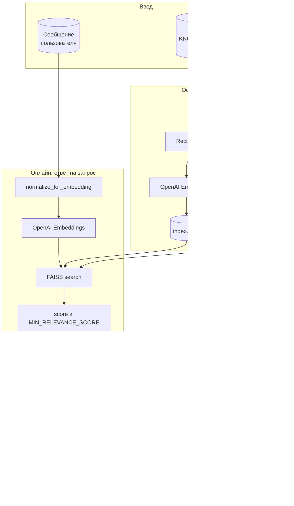

# Архитектура сервиса RAG Telegram Bot

## Обзор

Сервис — Telegram-бот с RAG (Retrieval-Augmented Generation): отвечает на вопросы пользователя на основе локальной базы знаний (по умолчанию папка `kb`, см. `KNOWLEDGE_BASE_PATH`).

- **Офлайн (индексация):** обход `.md`/`.txt` → очистка текста → чанкинг → эмбеддинги (OpenAI-совместимый API) → FAISS-индекс + `metadata.json`.
- **Онлайн (запрос):** сообщение пользователя → rate limit → (опционально: query expansion → несколько запросов) → нормализация → эмбеддинг → поиск (FAISS и при включённом гибриде — BM25) → (при гибриде/expansion: RRF) → (опционально: reranker) → топ-K чанков → сборка контекста → LLM (LangChain ChatOpenAI) → конвертация Markdown в HTML → отправка в Telegram.

---

## Схема: поток данных (общая)

---

## Схема: компоненты и файлы

---

## Детальное описание архитектуры

### Роли компонентов

| Слой | Компоненты | Назначение |
|------|------------|------------|
| **Вход** | Telegram API, aiogram | Получение сообщений пользователя, отправка ответов. |
| **Оркестрация** | `app/main.py` | Запуск бота, rate limit (N запросов/мин на чат), вызов retriever → llm → форматирование → отправка. |
| **Поиск** | `app/rag/retriever.py`, FAISS, `metadata.json`, опционально `rrf.py`, `reranker.py`, `query_expansion.py` | Загрузка индекса при старте; при включённом гибриде — построение BM25 из metadata. По запросу: опционально переформулировки (multi-query) → нормализация → эмбеддинг → поиск (FAISS; при гибриде ещё BM25 и RRF); опционально reranker → топ-K. |
| **Генерация** | `app/rag/llm.py` | LangChain: системный промпт (или RAG_SYSTEM_PROMPT из .env) + контекст (чанки с источниками) + запрос пользователя → ChatOpenAI → текст ответа. |
| **Форматирование** | `app/utils/telegram_format.py` | Преобразование Markdown (`**`, `*`, `` ` ``) в HTML Telegram (`<b>`, `<i>`, `<code>`), экранирование HTML. |
| **Конфигурация** | `app/config.py`, `.env` | Токены, URL API, пути, TOP_K, MIN_RELEVANCE_SCORE, лимиты. |
| **Индексация** | `app/rag/index_builder.py`, `text_cleaning.py` | Отдельный процесс: обход базы знаний → очистка → чанкинг → эмбеддинги → запись FAISS и metadata. |

### Внешние зависимости

- **Telegram**: Bot API (Long Polling).
- **OpenAI-совместимый API** (Polza, OpenAI и др.): эмбеддинги (`OPENAI_EMBEDDING_MODEL`) и чат-модель (`OPENAI_MODEL`).
- **Локальное хранилище**: каталог базы знаний (`KNOWLEDGE_BASE_PATH`), каталог индекса (`INDEX_PATH` с `index.faiss`, `metadata.json`).

### Поток одного запроса (пошагово)

1. Пользователь отправляет текстовое сообщение в Telegram.
2. **main.py**: проверка rate limit; при превышении — ответ «Подожди минуту».
3. **retriever.search(query)**:
   - При **QUERY_EXPANSION_ENABLED**: LLM переформулирует запрос → список запросов; для каждого выполняется поиск, результаты объединяются через RRF.
   - Иначе или для каждого варианта: `normalize_for_embedding(query)` → эмбеддинг запроса; FAISS-поиск до `fetch_k`; при **HYBRID_SEARCH_ENABLED** — также BM25 по чанкам из metadata, затем RRF слияние двух списков.
   - При **RERANKER_ENABLED**: топ-RERANKER_TOP_N кандидатов передаются в cross-encoder (локально или API), возвращается топ-K по rerank score.
   - Иначе: отбор по `score ≥ MIN_RELEVANCE_SCORE` (только в режиме без гибрида), обрезка до TOP_K.
   - Возврат списка `{text, source_path, score}`.
4. Если чанков нет — ответ «Ничего не найдено».
5. **llm.generate_answer(query, contexts)**:
   - склейка контекста: для каждого чанка строка `[Источник: path]\ntext`, разделитель `---`;
   - вызов LangChain: `PROMPT | ChatOpenAI` с полями `context`, `query`;
   - возврат строки ответа (часто с Markdown).
6. **markdown_to_telegram_html(answer)**: замена `**` → `<b>`, `*` → `<i>`, `` ` `` → `<code>`, экранирование `<`, `>`, `&`.
7. **message.answer(..., parse_mode="HTML")**: отправка в Telegram; при ошибке парсинга — отправка исходного текста без HTML.

---

## Расширенный RAG (опционально)

Три опции улучшения retrieval (включаются через `.env`, по умолчанию выключены):

- **Гибридный поиск (HYBRID_SEARCH_ENABLED):** кроме векторного поиска по FAISS выполняется лексический BM25 по текстам чанков (rank_bm25, токенизация по словам). Два списка кандидатов объединяются через **Reciprocal Rank Fusion** (RRF, k=60). BM25-индекс строится при загрузке retriever из `metadata.json`, отдельный файл индекса не нужен.
- **Reranker (RERANKER_ENABLED):** после получения кандидатов (из векторного или гибридного поиска, с запасом RERANKER_TOP_N) пары (запрос, текст чанка) прогоняются через cross-encoder (модель из sentence-transformers или внешний API). В контекст LLM попадают топ-K по score reranker’а.
- **Query expansion (QUERY_EXPANSION_ENABLED):** перед поиском запрос пользователя переформулируется LLM’ом в несколько вариантов (multi-query); для каждого выполняется поиск (векторный или гибридный), результаты объединяются через RRF. Улучшает покрытие по разным формулировкам вопроса.

Все три можно включать независимо; при одновременном включении порядок: expansion → поиск по каждому запросу → RRF → reranker → top_K.

---

## Компоненты по слоям

### 1. Точка входа

| Компонент | Файл | Назначение |
|-----------|------|------------|
| Telegram-бот | `app/main.py` | aiogram: polling, `/start`, обработка текстовых сообщений, rate limit, вызов RAG, форматирование ответа и отправка. |

---

### 2. Очистка текста

| Компонент | Файл | Назначение |
|-----------|------|------------|
| Очистка и нормализация | `app/rag/text_cleaning.py` | **clean_text**: Unicode NFC, удаление управляющих символов, единые переносы/табы, схлопывание пробелов и пустых строк. **should_skip_path**: исключение файлов `._*`, `.DS_Store`. **normalize_for_embedding**: нормализация запроса перед эмбеддингом (одна строка). |

Используется: при сборе документов в индексаторе; при эмбеддинге запроса в retriever.

---

### 3. Индексация (офлайн)

| Компонент | Файл | Назначение |
|-----------|------|------------|
| Сбор документов | `app/rag/index_builder.py` | Рекурсивный обход `.md`/`.txt`, пропуск по `should_skip_path`, чтение и **clean_text** содержимого. |
| Чанкинг | `app/rag/index_builder.py` | При наличии LangChain — **RecursiveCharacterTextSplitter** (separators `\n\n`, `\n`, ` `). Иначе — встроенное разбиение по параграфам с overlap. Параметры: CHUNK_SIZE, CHUNK_OVERLAP. |
| Эмбеддинги | `app/rag/index_builder.py` | OpenAI-совместимый API (Polza): batch-запросы к **OPENAI_EMBEDDING_MODEL**, L2-нормализация векторов. |
| Векторный индекс | `app/rag/index_builder.py` | FAISS IndexFlatIP, сохранение в `data/index/index.faiss`. Метаданные (текст чанка, source_path, chunk_index) — в `data/index/metadata.json`. |

Результат: на диске лежат `index.faiss` и `metadata.json`; при старте бота они загружаются в память.

---

### 4. Поиск (онлайн)

| Компонент | Файл | Назначение |
|-----------|------|------------|
| Retriever | `app/rag/retriever.py` | Загрузка FAISS и metadata; при **HYBRID_SEARCH_ENABLED** — построение BM25 из текстов чанков при `load()`. **search()**: опционально query expansion → для каждого запроса векторный (и при гибриде BM25) поиск → RRF слияние списков → опционально reranker → возврат топ-K `{text, source_path, score}`. |
| RRF | `app/rag/rrf.py` | **rrf_merge**: слияние нескольких ранжированных списков (по chunk_id) через Reciprocal Rank Fusion (k=60). Используется при гибридном поиске (вектор + BM25) и при multi-query. |
| Reranker | `app/rag/reranker.py` | **rerank(query, candidates, top_k)**: переранжирование кандидатов cross-encoder’ом. Либо внешний API (**RERANK_API_URL**), либо локальная модель sentence-transformers (**RERANKER_MODEL**). Включается через **RERANKER_ENABLED**. |
| Query expansion | `app/rag/query_expansion.py` | **expand_query_multi(query, num_variants)**: переформулировка запроса через LLM (2–3 варианта), возврат списка строк. Включается через **QUERY_EXPANSION_ENABLED**. |
| Оценка релевантности | `app/config.py` | **MIN_RELEVANCE_SCORE** — минимальный cosine similarity (только для векторного потока без гибрида); подбор: скрипт `app/rag/evaluate_relevance.py`. |

---

### 5. Генерация ответа

| Компонент | Файл | Назначение |
|-----------|------|------------|
| Цепочка LLM | `app/rag/llm.py` | **LangChain**: ChatPromptTemplate (системный промпт + шаблон с `{context}`, `{query}`) и **ChatOpenAI** (base_url, model). Цепочка `PROMPT \| llm`, вызов `chain.invoke`. Контекст — склейка чанков с указанием источников. |

Вход: запрос пользователя и список чанков от retriever. Выход: текст ответа (часто с Markdown).

---

### 6. Форматирование для Telegram

| Компонент | Файл | Назначение |
|-----------|------|------------|
| Markdown → HTML | `app/utils/telegram_format.py` | **markdown_to_telegram_html**: экранирование `&`, `<`, `>`; замена `**текст**` → `<b>текст</b>`, `*текст*` → `<i>текст</i>`, `` `код` `` → `<code>код</code>`. В **main.py** ответ отправляется с `parse_mode="HTML"`; при ошибке — fallback на обычный текст. |

---

### 7. Вспомогательные скрипты

| Скрипт | Назначение |
|--------|------------|
| `app/rag/check_retrieval.py` | По запросу выводит топ-K чанков с score и источником (проверка качества поиска). |
| `app/rag/evaluate_relevance.py` | Запуск тестовых запросов, вывод распределения score; подбор MIN_RELEVANCE_SCORE. |
| `app/rag/eval_answer_quality.py` | Полный пайплайн: несколько тестовых запросов → retrieval + генерация ответа; печать чанков и ответа бота (оценка качества выдачи). |

---

## Поток данных

### Индексация (один раз или после обновления базы)

1. Обход `KNOWLEDGE_BASE_PATH` → сбор `.md`/`.txt`, пропуск `._*`.
2. Для каждого файла: чтение → **clean_text** → разбиение на чанки (LangChain или встроенный сплиттер).
3. Batch-эмбеддинг чанков через OpenAI-совместимый API.
4. Запись FAISS-индекса и `metadata.json` в `INDEX_PATH`.

### Обработка сообщения пользователя

1. Текст сообщения → проверка rate limit.
2. При **QUERY_EXPANSION_ENABLED**: переформулировка запроса (LLM) → список запросов.
3. Для каждого запроса (или одного): **normalize_for_embedding** → эмбеддинг → поиск в FAISS (и при **HYBRID_SEARCH_ENABLED** — BM25 по тем же чанкам).
4. При гибриде или expansion: **rrf_merge** списков → один ранжированный список.
5. При **RERANKER_ENABLED**: передача до **RERANKER_TOP_N** кандидатов в reranker → топ-K по score reranker’а.
6. Иначе: фильтр по score ≥ MIN_RELEVANCE_SCORE (только векторный режим), обрезка до TOP_K.
7. Сборка строки контекста из чанков и источников.
8. LangChain: **PROMPT | ChatOpenAI** → ответ.
9. Отправка ответа в Telegram.

---

---

## Схема: развёртывание (сервер)

---

## Конфигурация (переменные окружения)

| Переменная | Роль в архитектуре |
|------------|---------------------|
| TELEGRAM_BOT_TOKEN | Подключение бота к Telegram. |
| OPENAI_API_KEY, OPENAI_API_BASE | Все вызовы к LLM и эмбеддингам (Polza и др.). |
| OPENAI_MODEL | Модель для генерации ответа (ChatOpenAI). |
| OPENAI_EMBEDDING_MODEL | Модель для эмбеддингов при индексации и поиске. |
| KNOWLEDGE_BASE_PATH | Корень базы знаний для индексации. |
| INDEX_PATH | Каталог с index.faiss и metadata.json. |
| CHUNK_SIZE, CHUNK_OVERLAP | Параметры чанкинга. |
| TOP_K | Сколько чанков передаётся в контекст LLM. |
| MIN_RELEVANCE_SCORE | Порог релевантности (cosine similarity); по умолчанию 0.45. Только для векторного поиска без гибрида. |
| RATE_LIMIT_PER_MINUTE | Лимит запросов в минуту на чат. |
| HYBRID_SEARCH_ENABLED | Включить гибридный поиск (BM25 + векторный + RRF). По умолчанию false. |
| HYBRID_FETCH_K | Сколько кандидатов брать с каждого потока до RRF (по умолчанию 30). |
| RERANKER_ENABLED | Включить переранжирование cross-encoder. По умолчанию false. |
| RERANKER_TOP_N | Сколько кандидатов отдавать в reranker (по умолчанию 20). |
| RERANKER_MODEL | Модель sentence-transformers для reranker (или через RERANK_API_URL). |
| RERANK_API_URL, RERANK_API_KEY | Опционально: внешний API для rerank. |
| QUERY_EXPANSION_ENABLED | Переформулировка запроса (multi-query) перед поиском. По умолчанию false. |
| QUERY_EXPANSION_VARIANTS | Число вариантов запроса (исходный + переформулировки). По умолчанию 3. |
| RAG_SYSTEM_PROMPT | Опционально: свой системный промпт для LLM (пусто = встроенный универсальный). |

---

## Стек технологий

- **Telegram**: aiogram 3.
- **Текст**: свой модуль очистки + LangChain RecursiveCharacterTextSplitter.
- **Эмбеддинги и LLM**: OpenAI-совместимый API (Polza), прямой OpenAI client для эмбеддингов, LangChain ChatOpenAI для ответа.
- **Векторный поиск**: FAISS (IndexFlatIP, L2-нормализация).
- **Гибридный поиск**: rank_bm25 (BM25 по чанкам), RRF в `app/rag/rrf.py`.
- **Reranker**: sentence-transformers (CrossEncoder) или внешний API.
- **Конфигурация**: python-dotenv, app/config.py.
